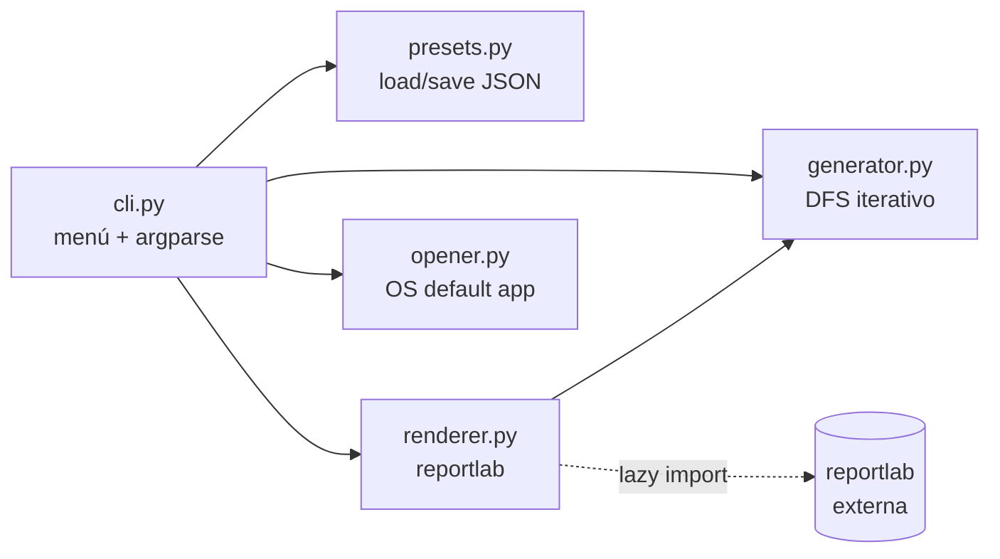
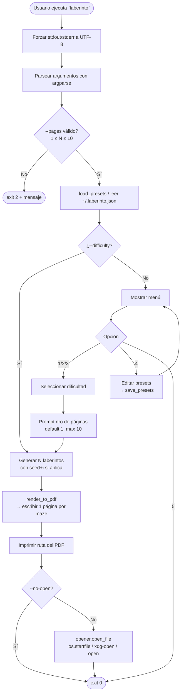

# Generador de Laberintos en PDF

CLI en Python que genera laberintos imprimibles en PDF, con tres niveles de dificultad editables, múltiples páginas por PDF, dos algoritmos (DFS / Prim) y opción de imprimir la solución.

[](https://github.com/walticogt/python-laberinto/actions/workflows/test.yml)    [](https://walticogt.github.io/python-laberinto/maze-visualizer.html)

<!--
Para añadir un GIF demo del visualizador:

1. Abre docs/maze-visualizer.html, configura W=H=10, seed=42, velocidad ~150 ms.
2. Captura la pantalla con ScreenToGif (https://www.screentogif.com/) o LICEcap.
3. Recorta el GIF a ~5-8 segundos mostrando: paso 2 (vecinos amarillos),
   paso 3 (elegido verde + flecha), paso 4 (avance), backtrack, terminación.
4. Guárdalo como docs/demo.gif (mantén bajo ~2 MB).
5. Descomenta la siguiente línea  y borra este bloque.
-->
<!--  -->


---

## Tabla de contenidos

- [Instalación](#instalación)
- [Uso rápido](#uso-rápido)
- [Configuración persistente](#configuración-persistente)
- [Compilar a `.exe`](#compilar-a-exe)
- [Lanzador `.bat` (sin compilar)](#lanzador-bat-sin-compilar)
- [Arquitectura](#arquitectura)
- [Flujo de una ejecución](#flujo-de-una-ejecución)
- [Algoritmo de generación (Randomized DFS iterativo)](#algoritmo-de-generación-randomized-dfs-iterativo)
- [Ejecutar el algoritmo paso a paso](#ejecutar-el-algoritmo-paso-a-paso)
- [Rendering a PDF](#rendering-a-pdf)
- [Desarrollo y tests](#desarrollo-y-tests)
- [Estructura del proyecto](#estructura-del-proyecto)
- [Glosario](#glosario)

---

## Instalación

Requiere **Python 3.11+**. Desde la raíz del proyecto:

```bash
python -m venv .venv
.venv\Scripts\activate       # Windows
pip install -e .
```

Esto expone el ejecutable `laberinto` en el venv.

## Uso rápido

### Menú interactivo

```bash
laberinto
```

```
=== Generador de Laberintos ===
  1) Básico    (15 x 15)
  2) Medio     (25 x 25)
  3) Complejo  (40 x 40)
  4) Editar dificultades
  5) Salir
Elige una opción: 2
Número de páginas [1-10, default 1]: 3
PDF generado (3 páginas): D:\...\laberinto_medium_3p.pdf
```

El PDF se abre automáticamente con la aplicación por defecto del sistema.

### Scripteado (sin menú)

```bash
laberinto --difficulty medium                       # 1 página, abre al terminar
laberinto --difficulty complex --pages 10 --seed 42 # 10 laberintos reproducibles
laberinto --difficulty simple --no-open             # no abre el PDF al terminar
```

### Flags

| Flag | Descripción |
|---|---|
| `--difficulty {simple,medium,complex}` | Salta el menú y genera directamente. |
| `--width W --height H` | Dimensiones custom (override del preset). Deben usarse juntas. |
| `--pages N` | Número de laberintos en el PDF (1–10). Default: `1`. |
| `--algorithm {dfs,prim}` | Algoritmo de generación. Default: `dfs`. |
| `--show-solution` | Dibuja el camino entrada→salida en rojo sobre el laberinto. |
| `--output PATH` | Ruta del PDF de salida. Default: `laberinto_<etiqueta>[_Np].pdf` en CWD. |
| `--seed INT` | Semilla para generación reproducible. Con `--pages N>1` usa `seed, seed+1, …`. |
| `--no-open` | No abre el PDF al terminar. |
| `--config PATH` | Ruta alternativa del archivo de configuración. |

### Ejemplos

```bash
laberinto --difficulty medium --show-solution     # con solución impresa
laberinto --width 20 --height 30                   # rectangular custom
laberinto --algorithm prim --difficulty complex    # Prim en vez de DFS
laberinto --difficulty simple --pages 10 --seed 1  # 10 mazes reproducibles
```

## Configuración persistente

Los tamaños de las dificultades se guardan en `~/.laberinto.json`:

```json
{
  "presets": {
    "simple": 15,
    "medium": 25,
    "complex": 40
  }
}
```

Edítalos desde el menú (opción 4) o a mano. Si el archivo no existe o está corrupto, se usan los defaults (15 / 25 / 40).

## Compilar a `.exe`

Útil cuando quieres distribuir el binario a máquinas que **no tienen Python instalado** (amigos, oficina, USB).

### Requisitos

```bash
pip install -e ".[build]"
```

Esto instala **PyInstaller** como extra opcional.

### Comando directo

```bash
pyinstaller --onefile --name laberinto --collect-all reportlab --console maze_pdf\__main__.py
```

El ejecutable queda en `dist\laberinto.exe` (~15-25 MB — incluye Python + reportlab empaquetados).

### Script helper

Para no tener que acordarte del comando:

```powershell
.\build.ps1
```

El script limpia `build\` y `dist\` previos, ejecuta PyInstaller y te imprime el tamaño final del `.exe`.

### Cómo funciona PyInstaller

1. **Analiza** tu código buscando imports estáticos.
2. **Recolecta** los módulos Python + las DLLs nativas de las dependencias (en este caso `reportlab`).
3. **Empaqueta** todo + un intérprete Python mínimo dentro de un único ejecutable comprimido.
4. En runtime, el `.exe` se **auto-extrae** a un directorio temporal y lanza el intérprete embebido.

Por eso `--collect-all reportlab` es importante: `reportlab` carga fuentes y módulos de forma dinámica que PyInstaller no detecta con el análisis estático.

### Cuándo rebuildar

Tras modificar cualquier archivo en `maze_pdf/`, simplemente:

```powershell
.\build.ps1
```

Tarda ~30-60 segundos. El `.exe` nuevo reemplaza al anterior en `dist\`.

---

## Lanzador `.bat` (sin compilar)

Si **no** quieres empaquetar un `.exe` con PyInstaller pero sí quieres un lanzador rápido con menú, usa [laberinto.bat](laberinto.bat). Activa el venv y llama a `python -m maze_pdf` con los flags correctos, todo dentro de la consola de Windows.

### Requisitos

- El venv debe estar creado en `.venv\` con el paquete instalado:
  ```bash
  python -m venv .venv
  .venv\Scripts\python.exe -m pip install -e .
  ```

### Uso

Doble clic en [laberinto.bat](laberinto.bat). Muestra este menú:

```
==================================================
        Generador de Laberintos
==================================================

  1) Basico    (preset "simple",  1 pagina)
  2) Medio     (preset "medium",  1 pagina)
  3) Complejo  (preset "complex", 1 pagina)

  4) Modo interactivo completo del CLI
     (menu en espanol, permite editar presets)

  5) Personalizado (multiples paginas)
  6) Personalizado con seed (reproducible)

  0) Salir
```

La opción `4` delega al menú interactivo en español del CLI (incluye "Editar dificultades"). Las opciones `5` y `6` piden `--pages` y opcionalmente `--seed`.

### `.exe` vs `.bat` — cuándo usar cada uno

| | **`.bat`** | **`.exe`** |
|---|---|---|
| Requiere Python instalado | ✅ Sí (en `.venv`) | ❌ No |
| Tamaño | ~2 KB | ~22 MB |
| Build previo | No | Sí (~30-60 s con PyInstaller) |
| Portable a otra PC sin Python | ❌ No | ✅ Sí |
| Reacciona a cambios en el código | ✅ Automático | ❌ Requiere rebuild |
| Menú con preselección | ✅ Sí | ❌ No (hay que usar flags o menú del CLI) |

Recomendación: usa el `.bat` en tu PC de desarrollo y durante iteraciones. El `.exe` solo cuando vayas a compartir con alguien que no tenga Python.

---

## Arquitectura

> **Nota sobre los diagramas**: las tres secciones que siguen (Arquitectura, Flujo, Algoritmo) incluyen diagramas escritos en sintaxis **Mermaid**. Se renderizan automáticamente en GitHub, GitLab, Obsidian, Typora y VSCode (con la extensión `bierner.markdown-mermaid`). En visores sin soporte de Mermaid verás solo el código fuente entre ```` ```mermaid ... ``` ```` — si quieres verlos renderizados sin instalar nada, pega el código en https://mermaid.live/.

El proyecto tiene cinco módulos en `maze_pdf/`, uno por responsabilidad:



**Por qué esta separación:**
- `generator.py` no sabe nada de PDFs — solo produce una estructura de datos.
- `renderer.py` no sabe cómo se generan los laberintos — recibe objetos `Maze`.
- `opener.py` aísla la lógica dependiente del sistema operativo (Windows / macOS / Linux), lo que permite mockearla trivialmente en tests.
- `presets.py` es la **única fuente de verdad** sobre tamaños y etiquetas.
- `cli.py` orquesta a los demás; es el único que tiene E/S con el usuario.

La flecha punteada a `reportlab` es un **lazy import** — solo se importa cuando se llama a `render_to_pdf()`, así `laberinto --help` arranca al instante sin cargar la dependencia pesada.

## Flujo de una ejecución



Los fallos en el paso de apertura son **no fatales** — el exit code sigue siendo 0 porque el PDF sí se produjo correctamente.

---

## Algoritmo de generación (Randomized DFS iterativo)

### Resumen en 7 pasos

1. **Empieza** en la celda `(1, 1)` y la marca como visitada.
2. **Mira los vecinos** de la celda actual que aún no estén visitados.
3. **Elige uno al azar** (si hay varios).
4. **Quita la pared** que los separa (abre un pasaje) y **avanza** hacia ese vecino.
5. **Repite desde el paso 2** con la nueva celda actual.
6. Si la celda actual **no tiene vecinos sin visitar** → **retrocede** una celda (pop del stack) y vuelve al paso 2 desde ahí.
7. **Termina** cuando el stack queda vacío: eso implica que toda la matriz está conectada como un único árbol (sin ciclos, sin celdas inalcanzables).

Al final abre la pared **norte** de la **primera celda** (entrada, arriba-izq) y la pared **sur** de la **última celda** (salida, abajo-der). Para una matriz `N × N` indexada 1..N², esas siempre son las **posiciones 1 y N²**; en un `3×3` son exactamente **1 y 9**.

### Qué es un "laberinto perfecto"

Un **laberinto perfecto** es una grilla donde:

1. **Existe exactamente un camino** entre cualesquiera dos celdas.
2. **No hay loops** (ciclos).
3. **No hay celdas inalcanzables**.

Matemáticamente, es un **árbol generador** (spanning tree) del grafo donde los nodos son las celdas y las aristas son las paredes potenciales entre celdas adyacentes. Para una grilla de `N×M`:

- Total de celdas: `N · M`
- Total de paredes internas: `2NM − N − M`
- **Pasajes en el laberinto final: `N · M − 1`** (propiedad de cualquier árbol con `N·M` nodos)

### Algoritmos disponibles

El proyecto incluye **DFS** (default) y **Prim** vía el flag `--algorithm`. Ambos producen laberintos perfectos, pero con personalidades muy distintas:

| Algoritmo | Forma visual | Complejidad | Flag |
|---|---|---|---|
| **DFS randomized** (default) | Pasillos largos, serpenteantes. Pocas bifurcaciones. **Se siente "difícil"**. | O(celdas) | `--algorithm dfs` |
| **Prim randomized** | Muchas bifurcaciones cortas, ramificado. Se siente "busy". | O(celdas · log) | `--algorithm prim` |
| Kruskal *(no implementado)* | Parecido a Prim. | O(celdas · α) | — |
| Wilson / Aldous-Broder *(no implementado)* | Uniforme (todas las topologías equiprobables). Estéticamente "nicer" pero más lento. | O(celdas²) peor caso | — |

Para mazes imprimibles donde una persona los va a resolver a mano, DFS gana: los pasillos largos hacen que el usuario crea que "ya casi llegó" y luego tiene que retroceder — es lo que hace divertido un laberinto en papel.

**Compara los dos visualmente** generando el mismo seed con cada uno:

```bash
laberinto --difficulty medium --seed 42 --algorithm dfs  --output dfs.pdf
laberinto --difficulty medium --seed 42 --algorithm prim --output prim.pdf
```

### Pseudocódigo

```
función generate(W, H, seed):
    cells = grilla W×H con todas las paredes levantadas
    visited = grilla W×H inicializada a False
    rng = Random(seed)

    stack = [(0, 0)]
    visited[0][0] = True

    mientras stack no vacío:
        (x, y) = stack.top()
        vecinos = vecinos_en_la_grilla_no_visitados(x, y)

        si vecinos está vacío:
            stack.pop()
        si no:
            (nx, ny, dirección) = rng.choice(vecinos)
            quitar_pared_entre((x,y), (nx,ny))
            visited[ny][nx] = True
            stack.push((nx, ny))

    abrir entrada (quitar pared N de (0,0))
    abrir salida (quitar pared S de (W-1, H-1))
    retornar Maze(cells, entry=(0,0), exit=(W-1,H-1))
```

**Por qué iterativo (con stack explícito) y no recursivo:**
- Python tiene un recursion limit default de `1000`. Una grilla 40×40 tiene 1600 celdas y en el peor caso la recursión profundiza tanto como las celdas → stack overflow.
- El stack explícito no tiene ese límite (solo la memoria disponible).

### Diagrama del algoritmo

```mermaid
flowchart TD
    Start([stack = [(0,0)]<br/>visited = {(0,0)}]) --> Empty{stack vacío?}
    Empty -->|Sí| Open[Abrir entrada y salida]
    Open --> Done([Retornar Maze])
    Empty -->|No| Peek["x,y = stack.top()"]
    Peek --> Neighbors["vecinos = celdas adyacentes<br/>dentro de la grilla<br/>que NO estén en visited"]
    Neighbors --> HasN{¿Hay vecinos?}
    HasN -->|No<br/>dead end| Pop[stack.pop<br/>backtrack]
    Pop --> Empty
    HasN -->|Sí| Pick[nx, ny = rng.choice vecinos]
    Pick --> Carve["Quitar pared entre x,y y nx,ny<br/>en ambos lados"]
    Carve --> Mark["visited[ny][nx] = True"]
    Mark --> Push[stack.push nx, ny]
    Push --> Empty
```

El backtracking (flecha "Pop → Empty") es el corazón del algoritmo: cuando la cabeza del DFS queda atrapada en un dead-end, retrocede hasta encontrar una celda con vecinos disponibles y continúa desde ahí.

### Paso a paso: generación de un laberinto 3×3

Antes de la traza, repasemos cómo se nombran las celdas y las direcciones — sin esto los pares `(0,0)`, `(1,0)` que verás abajo no tienen contexto.

#### Previo: sistema de coordenadas

Cada celda se identifica por un par **`(x, y)`**:

- **`x`** = columna. Va de **0 a W−1**, de **izquierda a derecha**.
- **`y`** = fila. Va de **0 a H−1**, de **arriba hacia abajo**. (Ojo: la `y` crece hacia abajo, no hacia arriba — es el convenio de gráficos de pantalla, al revés del plano cartesiano de matemáticas.)
- El **origen `(0, 0)`** es la celda de **arriba-izquierda**.

Para una grilla `3×3` (W=3, H=3), las 9 celdas son:

```
            x = 0      x = 1      x = 2
         ┌──────────┬──────────┬──────────┐
 y = 0   │  (0, 0)  │  (1, 0)  │  (2, 0)  │   ← fila superior
         ├──────────┼──────────┼──────────┤
 y = 1   │  (0, 1)  │  (1, 1)  │  (2, 1)  │   ← fila media
         ├──────────┼──────────┼──────────┤
 y = 2   │  (0, 2)  │  (1, 2)  │  (2, 2)  │   ← fila inferior
         └──────────┴──────────┴──────────┘
```

Las **cuatro direcciones** se leen sobre ese sistema:

| Dirección | Qué hace a las coordenadas | Vecino de `(x, y)` |
|---|---|---|
| **N** (norte) | `y` **disminuye** en 1 (sube) | `(x, y-1)` |
| **S** (sur)   | `y` **aumenta** en 1 (baja)  | `(x, y+1)` |
| **E** (este)  | `x` **aumenta** en 1 (derecha) | `(x+1, y)` |
| **O** (oeste) | `x` **disminuye** en 1 (izquierda) | `(x-1, y)` |

Una celda **en el borde** no tiene todos los vecinos: por ejemplo `(0, 0)` (esquina superior-izq) solo tiene vecinos al **S** y al **E**; sus direcciones N y O apuntan fuera de la grilla y se ignoran.

#### Cómo se leen las dos variables que vas a ver

- **`stack = [...]`** es una lista ordenada de celdas donde el DFS **puede retroceder**. El **último elemento** (el "top") es la celda donde está la cabeza del algoritmo *ahora*. Cuando la cabeza no encuentra vecinos sin visitar, hace **pop** (quita el último) y retrocede al anterior.
- **`visited = {...}`** es el conjunto de **todas** las celdas ya alcanzadas alguna vez. **Solo crece**, nunca se vacía. Cuando `visited` contiene las 9 celdas, el algoritmo ya pasó por todo el laberinto y solo quedan backtracks hasta vaciar el stack.

Las **entrada** y **salida** del laberinto son siempre:
- **Entrada**: celda `(0, 0)` — se abre quitando su pared **N** (hueco arriba).
- **Salida**: celda `(W−1, H−1)` — en un `3×3` eso es `(2, 2)`; se abre quitando su pared **S** (hueco abajo).

#### Cómo se lee la grilla ASCII

- `+` = esquina / intersección.
- `--` = pared **horizontal** (separa dos celdas verticalmente vecinas, o es borde superior/inferior).
- `|` = pared **vertical** (separa dos celdas horizontalmente vecinas, o es borde izq/der).
- **espacio** = pasaje (pared removida).

Cada pared interna es **compartida** por dos celdas: la "pared E de `(0,0)`" y la "pared O de `(1,0)`" son físicamente la misma línea vertical. Por eso, cuando el algoritmo avanza de `(0,0)` a `(1,0)`, quita las *dos* (una en cada lado de la estructura `Cell`) para que queden sincronizadas.

Con eso, ahora sí la traza:

**Para esta traza**, supón que `rng.choice` elige siempre el primer vecino disponible en orden `[N, S, E, O]` (en la realidad es aleatorio, pero fijarlo hace la traza reproducible en papel).

**Estado inicial** — todas las paredes intactas:

```
+--+--+--+
|  |  |  |
+--+--+--+
|  |  |  |
+--+--+--+
|  |  |  |
+--+--+--+

stack    = [(0,0)]
visited  = {(0,0)}
```

**Iteración 1** — cabeza en `(0,0)`. Vecinos no visitados: `E=(1,0)`, `S=(0,1)`. Elige `E`. Quita pared este de `(0,0)` y oeste de `(1,0)`:

```
+--+--+--+
|      |  |   ← pared entre (0,0) y (1,0) removida
+--+--+--+
|  |  |  |
+--+--+--+
|  |  |  |
+--+--+--+

stack    = [(0,0), (1,0)]
visited  = {(0,0), (1,0)}
```

**Iteración 2** — cabeza en `(1,0)`. Vecinos no visitados: `E=(2,0)`, `S=(1,1)`. Elige `E`:

```
+--+--+--+
|          |
+--+--+--+
|  |  |  |
+--+--+--+
|  |  |  |
+--+--+--+

stack    = [(0,0), (1,0), (2,0)]
visited  = {(0,0), (1,0), (2,0)}
```

**Iteración 3** — cabeza en `(2,0)`. Único vecino no visitado: `S=(2,1)`. Elige `S`:

```
+--+--+--+
|          |
+--+--+   +
|  |  |  |
+--+--+--+
|  |  |  |
+--+--+--+

stack    = [(0,0), (1,0), (2,0), (2,1)]
visited  = {(0,0), (1,0), (2,0), (2,1)}
```

**Iteración 4** — cabeza en `(2,1)`. Vecinos no visitados: `S=(2,2)`, `O=(1,1)`. Elige `S` (asumimos orden `[N,S,E,O]`):

```
+--+--+--+
|          |
+--+--+   +
|  |  |  |
+--+--+   +
|  |  |  |
+--+--+--+

stack    = [(0,0), (1,0), (2,0), (2,1), (2,2)]
visited  = {(0,0), (1,0), (2,0), (2,1), (2,2)}
```

**Iteración 5** — cabeza en `(2,2)`. Único vecino no visitado: `O=(1,2)`. Elige `O`:

```
+--+--+--+
|          |
+--+--+   +
|  |  |  |
+--+--+   +
|  |     |
+--+--+--+

stack    = [(0,0), (1,0), (2,0), (2,1), (2,2), (1,2)]
visited  = {..., (1,2)}
```

**Iteración 6** — cabeza en `(1,2)`. Vecinos no visitados: `N=(1,1)`, `O=(0,2)`. Elige `N`:

```
+--+--+--+
|          |
+--+--+   +
|  |     |
+--+--+   +
|  |     |
+--+--+--+

stack    = [..., (1,2), (1,1)]
visited  = {..., (1,1)}
```

**Iteración 7** — cabeza en `(1,1)`. Único vecino no visitado: `O=(0,1)`. Elige `O`:

```
+--+--+--+
|          |
+--+--+   +
|        |
+--+--+   +
|  |     |
+--+--+--+

stack    = [..., (1,1), (0,1)]
visited  = {..., (0,1)}
```

**Iteración 8** — cabeza en `(0,1)`. Único vecino no visitado: `S=(0,2)`. Elige `S`:

```
+--+--+--+
|          |
+--+--+   +
|        |
+  +--+   +
|        |
+--+--+--+

stack    = [..., (0,1), (0,2)]
visited  = {todas las 9 celdas}
```

**Iteraciones 9-N** — backtracking puro. `(0,2)` no tiene vecinos no visitados → pop. `(0,1)` tampoco → pop. Y así hasta que el stack queda vacío.

**Estado final** tras abrir entrada y salida:

```
      ↓  (entrada)
+   +--+--+
|          |
+--+--+   +
|        |
+  +--+   +
|        |
+--+--+   +
      ↑  (salida)
```

Contemos: 9 celdas, 8 pasajes (N·M − 1 = 8 ✓). El camino de entrada a salida existe y es único. Laberinto perfecto generado.

### Ejecutar el algoritmo paso a paso

Hay un **visualizador interactivo en HTML + JavaScript** en [docs/maze-visualizer.html](docs/maze-visualizer.html) que ejecuta el mismo algoritmo que el generador Python y te deja ver cada iteración.

#### Cuatro formas de abrirlo

**A) En vivo (ya hosteado)** — la más cómoda si solo quieres probarlo:

> **🔗 https://walticogt.github.io/python-laberinto/maze-visualizer.html**

Hosteado gratis vía GitHub Pages desde la carpeta `docs/` de este repo.

**B) Doble clic (local)** — abre [docs/maze-visualizer.html](docs/maze-visualizer.html) desde el explorador de archivos; carga en cualquier navegador moderno sin servidor.

**C) Tu propio GitHub Pages** — si forkeas o cloneas: Settings → Pages → Source: `Deploy from a branch` → Branch: `main` / `/docs` → Save. Obtienes `https://<tu-usuario>.github.io/<repo>/maze-visualizer.html`.

**D) Drag-and-drop a un host estático** — Netlify / Vercel / Cloudflare Pages. Arrastra el archivo `.html` (o toda la carpeta `docs/`) y te dan una URL en segundos.

> **Sobre `<iframe>` en este README**: GitHub/GitLab sanean HTML interactivo en los `.md`, así que un `<iframe src="docs/maze-visualizer.html">` no renderiza en esas plataformas. VSCode sí lo renderiza en la previsualización local pero con restricciones de CORS. Por eso la recomendación es **link directo** (arriba) en vez de embed.

#### Qué obtienes

- Canvas que dibuja la grilla en tiempo real.
- Celdas coloreadas por estado: **azul = celda actual (top del stack)**, azul oscuro = en el stack, gris = visitada fuera del stack, blanco = no visitada aún.
- Botones **Paso**, **Play**, **Pausa**, **Terminar** y **Reset**.
- Controles: ancho, alto, seed, velocidad (ms/paso).
- Panel lateral con iteración actual, celda actual, profundidad del stack, celdas visitadas, última acción.
- Log de todas las iteraciones: `iter 17: (3,2) -N-> (3,1) | tope=8`.
- Sección desplegable con el código JavaScript del algoritmo (el mismo que está corriendo).

El PRNG (`mulberry32`) es seedable, así que **con el mismo seed obtienes exactamente el mismo laberinto** — útil para reproducir una traza específica. (Ojo: Python y JS usan PRNGs distintos, así que las trazas serán diferentes con el mismo número de seed entre las dos herramientas; pero cada una es reproducible consigo misma.)

#### Modo resolver interactivo

Una vez que el laberinto termina de generarse, se habilitan tres botones extra:

- **✏ Modo resolver** — entra al modo de juego. Click + arrastra desde la entrada (verde) para dibujar tu camino. El cursor cambia a "crosshair". Sólo permite movimientos a celdas adyacentes conectadas por pasaje (intentar cruzar una pared imprime un aviso al log y rechaza el movimiento). Volver al penúltimo movimiento lo deshace. Si llegas a la salida (roja), el camino se pinta en verde y aparece "🎉 ¡resuelto en N pasos!" en el log.
- **🔍 Ver solución** — corre BFS sobre el laberinto y dibuja el camino correcto en **rojo punteado**, encima de tu intento. Útil cuando te trabas o quieres comparar tu ruta con la óptima.
- **🧹 Limpiar intento** — vuelve el dibujo al inicio sin salir del modo resolver.

### Nota sobre el determinismo

Si llamas `generate(3, 3, seed=42)` dos veces, obtienes exactamente el mismo laberinto — `rng.choice` consume la secuencia determinista de `random.Random(42)`. Sin `seed`, el generador usa `random.SystemRandom()` (entropía del OS), por lo que cada ejecución es distinta.

Con `--pages N --seed S`, la página `i` usa `seed = S + i`. Es decir: reproducible + cada página distinta.

---

## Rendering a PDF

### Auto-fit a una página

El renderer **garantiza** que cualquier laberinto de `N × N` con `N ≥ 2` cabe en una sola página. Cómo:

```
cell_size_mm = min(
    (ancho_página_mm  - 2 × margen_mm) / N,
    (alto_página_mm   - 2 × margen_mm) / N
)
```

Para A4 (210×297 mm, margen 15 mm):
- **N=5** → `cell_size = min(180/5, 267/5) = 36 mm/celda` (muy grande, fácil de resolver)
- **N=15** → `cell_size = 12 mm/celda`
- **N=40** → `cell_size = 4.5 mm/celda`
- **N=60** → `cell_size = 3 mm/celda` (denso)

### Grosor de línea escalonado

Las celdas pequeñas requieren líneas más finas para que el laberinto se vea (si no las paredes ocuparían casi toda la celda). Tiers:

| Rango de N | Grosor | Notas |
|---|---|---|
| N ≤ 25 | 0.75 pt | legible hasta en impresoras malas |
| 25 < N ≤ 40 | 0.5 pt | estándar |
| 40 < N ≤ 60 | 0.4 pt | límite razonable |
| N > 60 | 0.3 pt | warning: puede ser ilegible al imprimir |

### Cómo se evita dibujar paredes dos veces

Dos celdas adyacentes comparten una pared. Si el renderer dibujara "todas las paredes de cada celda", cada pared interna se trazaría dos veces (ink waste + look borroso en algunos visores).

**Estrategia del renderer**:
- Por cada celda, dibuja **sólo** sus paredes `north` y `west` si están presentes.
- Las paredes `south` y `east` se dibujan **sólo si la celda está en el borde inferior / derecho**.

Funciona porque el generador mantiene las paredes sincronizadas: al quitar la pared norte de `(x,y)`, también quita la pared sur de `(x,y−1)`. Entonces si la pared norte de una celda interior está presente, también lo está la pared sur de la celda de arriba — y basta con que cualquiera de las dos se dibuje.

Entry/exit funciona "gratis": `cells[0][0].north = False` y `cells[H-1][W-1].south = False` producen los huecos visibles porque `(0,0)` tiene `north=False` (no dibujado) y la celda `(W-1, H-1)` tiene `south=False` aunque sea borde (no dibujado).

---

## Desarrollo y tests

```bash
pip install -e ".[dev]"
pytest
```

41 tests cubren:
- **Generador**: propiedades de maze perfecto (pasajes = N·M−1, grafo conexo, sin ciclos), determinismo por seed, validación de inputs.
- **Presets**: defaults cuando no hay config, fallback en JSON corrupto, merge parcial, round-trip save/load, validaciones, warning en N>60.
- **Renderer**: PDF válido (magic `%PDF-`), multi-página, lista vacía rechazada, auto-fit, rechazo de page_size inválido.
- **CLI**: flags válidos generan PDF, opener es monkeypatcheable, `--pages` se valida en rango 1–10, flujos interactivos (edit de presets, prompt de páginas).

Los tests manuales quedan en [openspec/changes/maze-pdf-generator/tasks.md](openspec/changes/maze-pdf-generator/tasks.md) grupo 8.

## Estructura del proyecto

```
python-laberinto/
├── maze_pdf/
│   ├── __init__.py
│   ├── __main__.py         # python -m maze_pdf
│   ├── cli.py              # argparse + menú + flujos interactivos
│   ├── presets.py          # defaults + load/save JSON atómico
│   ├── generator.py        # Cell/Maze dataclasses + DFS iterativo
│   ├── renderer.py         # reportlab + auto-fit + line weight tiers
│   └── opener.py           # os.startfile / xdg-open / open
├── tests/
│   ├── test_cli.py
│   ├── test_generator.py
│   ├── test_presets.py
│   └── test_renderer.py
├── openspec/               # specs + design + tasks del proyecto
│   ├── changes/
│   ├── specs/
│   └── project.md
├── docs/
│   └── maze-visualizer.html  # visualizador interactivo en el navegador
├── build.ps1               # helper PyInstaller (genera dist/laberinto.exe)
├── laberinto.bat           # lanzador con menú para Windows (usa .venv)
├── pyproject.toml
└── README.md               # este archivo
```

## Glosario

Definiciones simples, sin tecnicismos, para consultar cuando te encuentres una palabra que no reconoces.

### Del laberinto

- **Celda**: cada cuadradito de la grilla. Un laberinto 3×3 tiene 9 celdas.
- **Grilla** (o matriz): la tabla completa de celdas, organizada en filas y columnas. "Matriz 3×3" quiere decir 3 filas por 3 columnas.
- **Pared**: la línea que separa dos celdas. Cada celda tiene 4 paredes posibles: arriba (norte), abajo (sur), derecha (este), izquierda (oeste).
- **Pasaje**: una pared que se quitó. Conecta dos celdas. Es por donde caminas cuando resuelves el laberinto.
- **Vecino**: una celda pegada a otra por algún lado. Una celda de esquina tiene 2 vecinos, una de borde tiene 3, una del interior tiene 4.
- **Entrada / salida**: los dos únicos huecos del laberinto que lo conectan con el "afuera". Por defecto, la entrada está arriba-izquierda y la salida abajo-derecha.
- **Laberinto perfecto**: un laberinto que cumple **tres condiciones** al mismo tiempo:
  1. **Todo está conectado**: desde cualquier celda puedes llegar caminando a cualquier otra. No hay celdas aisladas ni "islas" inaccesibles.
  2. **El camino entre dos celdas es único**: si eliges dos celdas, hay **un solo** recorrido posible entre ellas (sin contar ir y volver). No hay atajos ni rutas alternativas.
  3. **No hay ciclos**: no puedes caminar en círculo y volver al mismo punto sin retroceder por donde viniste.

  En la vida real, esto se siente así: cuando resuelves el laberinto con un lápiz, si tomas un camino equivocado y llegas a un callejón sin salida, la **única** forma de seguir es **retroceder** hasta la última bifurcación — nunca hay un atajo que te saque del apuro.

  Los laberintos que **no** son perfectos suelen tener ciclos ("laberintos trenzados", que son más fáciles porque puedes rodear obstáculos) o áreas desconectadas (que ni siquiera son laberintos resolubles). Matemáticamente, un laberinto perfecto es equivalente a un **árbol** en teoría de grafos: tronco, ramas, hojas, pero ninguna rama vuelve a unirse con otra.

  **Todos los laberintos que genera esta herramienta son perfectos** — es una propiedad garantizada por el algoritmo DFS.

### Del algoritmo

- **Algoritmo**: una receta. Una secuencia exacta de pasos que resuelve un problema siempre igual.
- **Iteración**: una vuelta del bucle. Cada vez que el algoritmo hace "mirar vecinos, elegir uno, avanzar o retroceder" cuenta como una iteración.
- **Visitada** (celda): una celda por la que el algoritmo ya pasó al menos una vez. Una vez visitada nunca se reconsidera.
- **Stack** (en español "pila"): una lista de "lugares a los que puedo volver si me atoro". Imagínate un montón de platos: el **último** que pones arriba es el **primero** que puedes quitar. El algoritmo mete celdas en el stack mientras avanza y las saca cuando necesita retroceder.
- **Push** (apilar): meter una celda **encima** del stack.
- **Pop** (desapilar): quitar la celda **de encima** del stack. Es el movimiento de "retroceder".
- **Backtrack** (retroceder): cuando la celda actual no tiene vecinos sin visitar, el algoritmo da marcha atrás a la celda anterior del stack (hace un `pop`) y prueba desde ahí. Es lo que le permite no quedar atrapado en callejones.
- **Aleatorio** (al azar): sin criterio, como tirar un dado. Si hay varios vecinos disponibles, el algoritmo elige uno sin preferencia. Por eso cada ejecución produce un laberinto distinto.
- **Seed** (en español "semilla"): un número que le dice al generador de aleatorios **desde dónde arrancar su secuencia**. Con el **mismo seed**, obtienes **exactamente el mismo laberinto** todas las veces. Sin seed, cada corrida es distinta. Sirve para reproducir un laberinto específico o para tests.
- **DFS** (*Depth-First Search*, **búsqueda en profundidad**): la estrategia del algoritmo. Significa: "sigue avanzando mientras puedas; solo retrocede cuando te atores". Lo contrario sería BFS (ir explorando en anillos concéntricos), que produciría laberintos muy distintos.

### De la herramienta

- **CLI** (*Command Line Interface*, **línea de comandos**): un programa que se usa escribiendo texto en una terminal (cmd, PowerShell, Terminal…), en vez de con ventanas y botones. Escribes `laberinto` y el programa te responde con texto.
- **PDF**: formato de documento universal, ideal para imprimir. Cualquier computadora puede abrir un PDF sin instalar nada especial.
- **Render** (renderizar): el acto de "dibujar" algo. Aquí, convertir la estructura interna del laberinto en líneas negras sobre un PDF.
- **Canvas** ("lienzo"): un área rectangular dentro de una página web donde JavaScript puede dibujar formas. Es lo que usa el visualizador interactivo.
- **venv** (*virtual environment*, **entorno virtual**): una carpeta aislada que contiene una copia propia de Python y sus librerías solo para este proyecto. Evita que las librerías de distintos proyectos se pisen entre sí.
- **Dependencia**: una librería externa que el proyecto necesita para funcionar. Este proyecto depende de `reportlab` (para generar PDFs).
- **`.exe`** (ejecutable): un único archivo de Windows que se abre con doble clic. No hace falta tener Python instalado.
- **PyInstaller**: la herramienta que "empaqueta" tu programa Python + un intérprete Python mínimo + todas las librerías dentro de un único `.exe` distribuible.
- **Preset**: una configuración ya preparada, con nombre. Los tres presets de dificultad (`simple`, `medium`, `complex`) son valores guardados para no tener que elegir el tamaño manualmente cada vez.
- **Config** (de *configuration*): un archivo con tus preferencias guardadas. Aquí es `~/.laberinto.json` con los tamaños de los tres niveles.

## Licencia

MIT.
